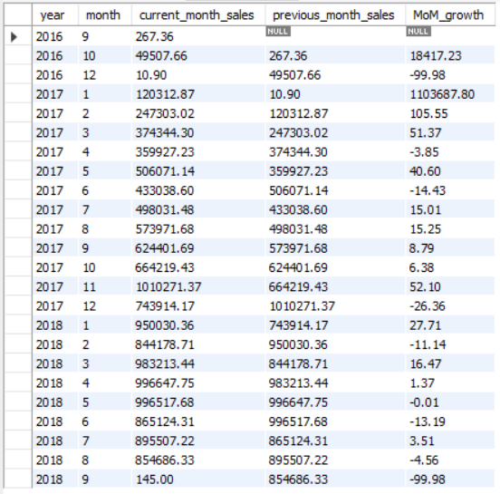
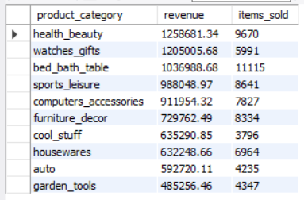
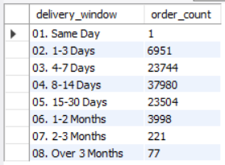
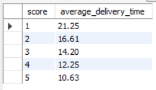
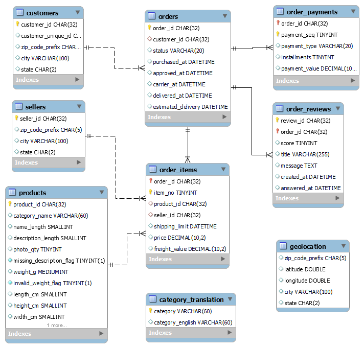

# Brazilian E-commerce Analysis using MySQL

## Project Overview

This project demonstrates a complete SQL data analysis workflow using the Brazilian E-commerce Public Dataset by Olist. Starting from raw CSV files, it creates a relational database in MySQL, profiles and prepares the data, enforces data integrity, and performs business analysis to generate insights into sales, customers, products, sellers, delivery performance, payments, order status, and customer reviews.


## Business Questions Addressed

This project investigates the Brazilian E-commerce dataset to answer questions such as:

* Sales performance and revenue trends
* Customer purchasing behavior
* Product and category performance
* Seller performance
* Delivery efficiency
* Customer satisfaction
* Payment behavior
* Geographic distribution of orders


## Key Business Insights

### Sales

* Total sales revenue of 13.59 million was generated (based on product prices).
* Sales and order volumes grew steadily throughout 2017, peaking in November 2017.



### Customers

* Customer spending was highly concentrated among a small number of customers.
* New customers consistently outnumbered repeat customers.

### Products

* Health & Beauty, Watches & Gifts, and Bed & Bath Table were the highest revenue categories.



### Sellers

* Seller performance varied significantly across the marketplace.

### Delivery Performance

* Most deliveries were completed within two weeks, indicating generally efficient logistics and acceptable delivery times for most customers.

 

### Reviews

* Lower review scores were associated with longer delivery times.



### Payments

* Credit cards and single-installment payments dominated customer payment behavior.

### Order Status
* Approximately 97% of orders were successfully delivered while cancellations remained below 1%.

### Locations
* São Paulo accounted for the largest share of customers and sales.


**Analysis Assumptions**

* Revenue analysis is based on product prices rather than payment values because payment records represent transactions rather than product-level sales.
* Customer-level analysis uses customer_unique_id instead of customer_id.
* Data anomalies were documented instead of overwritten whenever the correct values could not be determined.


## Dataset

This project uses the publicly available **Brazilian E-commerce Public Dataset by Olist**, available on Kaggle.

> Note: The raw dataset is not included in this repository due to licensing and repository size limitations.


## ER Diagram



The database consists of nine relational tables representing customers, orders, products, sellers, payments, reviews, geolocations, and category translations.


## Technology Stack

| Category        | Tools           |
| --------------- | --------------- |
| Database        | MySQL 8.x       |
| SQL IDE         | MySQL Workbench |
| Data Source     | CSV Files       |
| Version Control | Git & GitHub    |
| Documentation   | Markdown        |


## Project Workflow

The project follows a structured ETL and analytics workflow:

| Stage | Description |
|-------|-------------|
| Database Design | Designed a normalized relational database schema from raw CSV files. |
| Data Loading | Imported and validated data using MySQL. |
| Data Profiling | Identified missing values, duplicates, and data quality issues. |
| Data Preparation | Preserved source data while implementing quality flags and documenting anomalies. |
| Constraint Implementation | Added primary and foreign key constraints after validation. |
| Business Analysis | Analyzed sales, customers, products, sellers, payments, deliveries, and reviews to generate business insights. |


## Getting Started

To reproduce this project:

1. Download the [Brazilian E-commerce Public Dataset by Olist from Kaggle](https://www.kaggle.com/datasets/olistbr/brazilian-ecommerce?resource=download).

2. Create a new MySQL database.

3. Update the file paths in `02_load_data.sql` to match your local dataset location.

4. Execute the SQL scripts in the following order:

```
01_create_tables.sql
02_load_data.sql
03_profile_data.sql
04_prepare_data.sql
05_add_constraints.sql
06_analysis.sql
```

5. Refer to the documentation for additional details:

Project Overview.md
Database Design.md


## Documentation

Additional documentation is available in:

- **[project-overview](project-overview.md)** – Overview of the project workflow, ETL process, data profiling, preparation methodology, and business analysis.

- **[database-design](database-design.md)** – Database schema, table relationships, and design decisions.


## Acknowledgements

This project uses the **Brazilian E-commerce Public Dataset by Olist**, made publicly available for learning and analytical purposes.

The project was developed as a portfolio project to demonstrate practical SQL, ETL, and data analysis skills using real-world transactional data.
